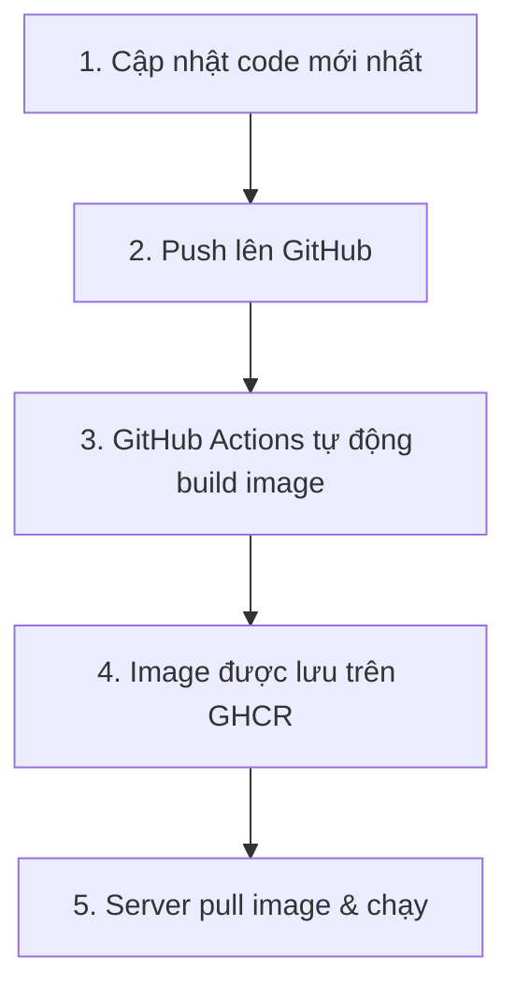

# Hướng dẫn quản lý Jobe Docker Image

## Tổng quan quy trình



---

## A. Thiết lập ban đầu (làm 1 lần)

### A1. Cấu hình GitHub Repository

1. Vào repo `xuanhoatrieu/jobe` trên GitHub
2. **Settings → Actions → General → Workflow permissions**
3. Chọn **Read and write permissions** → Save

### A2. Build image lần đầu trên server

```bash
cd /home/moodle/jobe
sudo docker compose build
sudo docker compose up -d
```

### A3. Push code lên GitHub để kích hoạt CI/CD

```bash
cd /home/moodle/jobe
git add -A
git commit -m "Add Dockerfile and CI/CD for custom Jobe image"
git push origin master
```

> [!NOTE]
> Sau bước này, GitHub Actions sẽ tự build image và push lên GHCR. Kiểm tra tại: `https://github.com/xuanhoatrieu/jobe/actions`

---

## B. Cập nhật khi tác giả update Jobe mới

### B1. Rebuild image (lấy code Jobe mới nhất từ tác giả)

```bash
cd /home/moodle/jobe
sudo docker compose build --no-cache
sudo docker compose up -d
```

> [!TIP]
> `--no-cache` buộc Docker clone lại code Jobe mới nhất từ `trampgeek/jobe`.

### B2. Kiểm tra hoạt động

```bash
curl http://localhost:4000/jobe/index.php/restapi/languages
```

### B3. Push lên GitHub để CI/CD cập nhật image trên GHCR

```bash
cd /home/moodle/jobe

# Đánh tag version mới (thay ngày tương ứng)
git add -A
git commit --allow-empty -m "Rebuild: update Jobe $(date +%Y-%m-%d)"
git push origin master
```

### B4. Kiểm tra CI/CD

- Vào `https://github.com/xuanhoatrieu/jobe/actions`
- Đợi workflow **"Build and Push Jobe Docker Image"** hoàn thành ✅

---

## C. Cài lại trên server mới (hoặc sau sự cố)

Chỉ cần **2 lệnh**, không cần build:

```bash
# Pull image đã build sẵn từ GHCR
sudo docker pull ghcr.io/xuanhoatrieu/jobe-datascience:latest

# Chạy container
sudo docker run -d \
  -p 4000:80 \
  --restart unless-stopped \
  --name jobe \
  ghcr.io/xuanhoatrieu/jobe-datascience:latest
```

Hoặc dùng docker-compose (cần copy file `docker-compose.pull.yml`):

```bash
sudo docker compose -f docker-compose.pull.yml up -d
```

---

## D. Thêm thư viện Python mới

### D1. Sửa Dockerfile

Mở [Dockerfile](file:///home/moodle/jobe/Dockerfile), thêm thư viện vào dòng `pip3 install`:

```diff
    pip3 install --no-cache-dir --break-system-packages \
        numpy \
        pandas \
+       networkx \
+       statsmodels \
```

### D2. Build lại & push

```bash
cd /home/moodle/jobe
sudo docker compose build --no-cache
sudo docker compose up -d

# Push lên GitHub để cập nhật image trên GHCR
git add Dockerfile
git commit -m "Add networkx, statsmodels"
git push origin master
```

---

## E. Các lệnh quản lý hàng ngày

| Thao tác | Lệnh |
|----------|-------|
| Xem trạng thái | `sudo docker compose ps` |
| Xem logs | `sudo docker compose logs -f jobe` |
| Khởi động lại | `sudo docker compose restart` |
| Dừng | `sudo docker compose down` |
| Vào trong container | `sudo docker exec -it jobe bash` |
| Chạy test | `sudo docker exec -t jobe python3 /var/www/html/jobe/testsubmit.py` |

---

## F. Cấu hình Moodle CodeRunner

Trong Moodle: **Site Administration → Plugins → Question types → CodeRunner**

- **Jobe server**: `jobe.ttnt.io.vn`
- Không cần ghi `http://` phía trước
